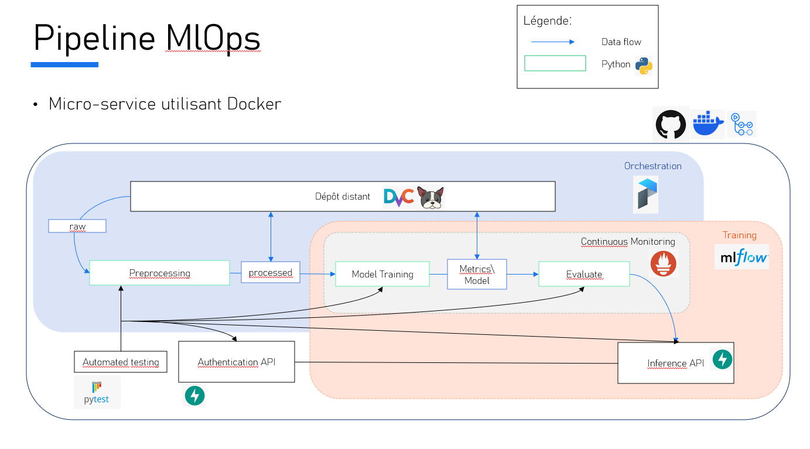

 ```
├── .github/                                 # GitHub Actions CI/CD pipeline configuration
│   └── workflows/                          # Directory for GitHub Actions workflow files
│       └── ci-cd.yml                       # Implementation of CI/CD pipeline
├── .dvc                                     # DVC tracking files for versioning datasets and models
├── .dvcignore                               # Files ignored by DVC
├── README.md                                # Project documentation and instructions
├── docker-compose.yml                       # Docker Compose configuration for container orchestration
├── metrics.dvc                              # Versioned metrics for model evaluation
├── models.dvc                               # DVC file to track versions of trained models
├── pipeline.py                              # Prefect-based pipeline for automating workflows
├── production.dvc                           # Tracks the current production-ready model
├── requirements.txt                        # Global dependencies for the project
├── requirements-dev.txt                    # Development dependencies, e.g., for testing and linting
├── data/                                    # Data directory with raw, processed, and inference-specific datasets
│   ├── raw/                                # Raw data (unprocessed, uncleaned data)
│   ├── processed/                          # Processed data ready for training and inference
│   └── patients_inference/                 # Inference-specific patient data
├── tests/                                   # Unit tests directory for testing services and modules
│   ├── test_authentication.py              # Tests for the authentication service
│   ├── test_evaluate.py                    # Tests for the model evaluation service
│   ├── test_inference.py                   # Tests for the inference API
│   ├── test_model_training.py              # Tests for the model training service
│   └── test_preprocessing.py               # Tests for the preprocessing service
├── mlflow_data/                             # MLflow directory for experiment tracking and artifacts
│   └── mlflow.db                           # MLflow SQLite database and artifact storage
├── services/                                # Microservices for different components of the pipeline
│   ├── authentication/                     # JWT-based authentication API
│   ├── evaluate/                           # Model evaluation and promotion scripts
│   ├── inference/                          # FastAPI-based inference API
│   ├── model_training/                     # Model training service (training models)
│   ├── patient_data_pull/                  # Extracts patient-specific data for inference
│   └── preprocessing/                      # Preprocessing service for data cleaning and preparation
└── .gitignore                               # Files ignored by Git
 ```

éxecution simple lancer start.sh
sortie ctrl + c



Pipeline MlOps qui sers de flag pour détecter les crises d'épilepsie à partir d'EEG.
testée sur la pipeline test : 


